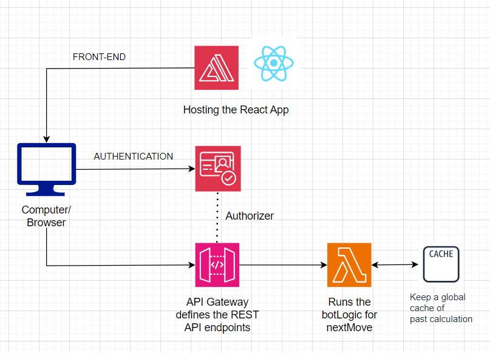

# TicTacToe 4x4 Bot Fully Deployed

### DO NOT use the application for more than few (5 - 10) times for testing.
This is because I'm using AWS Free Tier, and there is a limit on when it should stop being free. Please only use the demo link for limited testing purpose (no sharing with friends, etc.). Sorry for the inconvenience :(

### Presentation Record: https://youtu.be/RdgV9wwlrPw

### Project Application link: https://main.d3t7na3y4yzra6.amplifyapp.com/

Username: khangluong2004@gmail.com

Password: 12345678aA!

## Project Plan:
A full-stack web app for user to practice tic-tac-toe on a 4x4 grid (so they have a chance to win)
with an automatic bot, aimed to be fully deployed on AWS.

Tech-stack: Serverless architecture

1. Front-end: React JS - AWS Amplify
2. Authentication: AWS Cognito
3. Back-end: Python (AWS Lambda)
4. API REST API Endpoints: AWS Gateway API

## Project aims:
1. Familiarize myself with Cloud computing, Serverless architecture and Hosting
2. Have fun working on classic minimax searching algorithm on the bot
3. Make a not-too-serious app that my friends (who are too lazy to do all the set up) could have a bit of fun straight away

## Separate repos for Backend and Frontend
The repos for Backend and Frontend are included separately as submodules in this repo. The setting up of infrastructure on AWS unfortunately can only be demonstrated via the attached diagram and the recording.

## Progress:
1. Finished the bare UI for playing with Front-end + Test AWS Amplify
2. Set up AWS Cognito + Connect it to AWS Amplify
3. Set up AWS Lambda + AWS API GateWay, and connect the AWS Lambda to AWS API Gateway, setting AWS Cognito as an authorizer
4. Finish botLogic (not cached, since relatively fast enough) and add to AWS Lambda
5. Fix bugs, update both Backend and Frontend, and connect Frontend to Backend
6. Deploy to Amplify + complete documentation + record presentation

## Useful resources
1. A rough guide on how to build a serverless web application (not too good for specifics, more of general view): https://aws.amazon.com/getting-started/hands-on/build-serverless-web-app-lambda-apigateway-s3-dynamodb-cognito/ 
